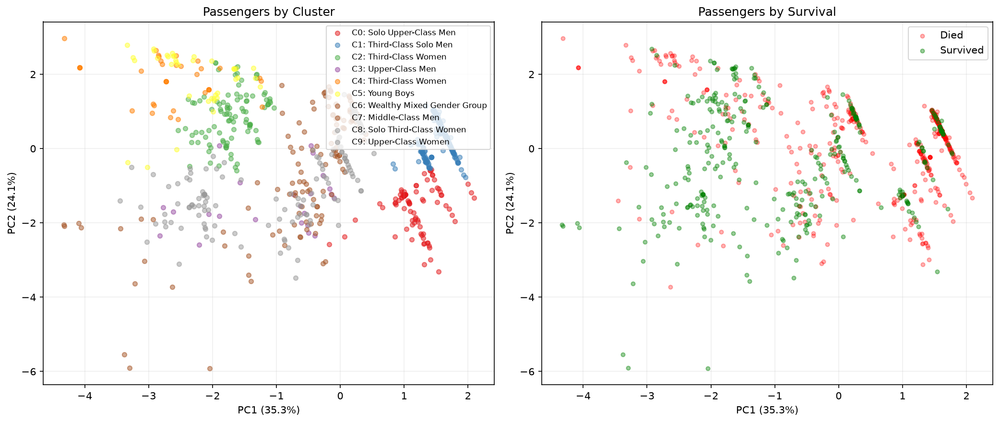

# A Different Perspective: What K-Means Clustering Reveals About Titanic Passengers

*Everyone does classification on Titanic. What if we step back and ask: what natural groups existed on this ship?*

---

## The Setup: Unsupervised Before Supervised

Every Titanic tutorial follows the same path: load data, engineer features, train a classifier, submit. You end up knowing *which features predict survival* — but do you really understand *who these passengers were*?

What if we flip the script? Instead of immediately asking "who survives?", we first ask: "what natural groups of passengers existed on this ship?" Then we check whether those groups align with survival patterns — and whether that knowledge can improve our predictions.

This is the core idea behind using unsupervised methods as a preprocessing step for supervised tasks. You discover structure first, then exploit it.

## The Approach

K-Means clustering groups similar passengers together based on their features, with no knowledge of who survived. We use seven features that capture the key dimensions of a passenger's identity:

```python
features = ['IsFemale', 'Pclass', 'Age', 'Fare', 'FamilySize', 'IsAlone', 'TitleCode']
```

These features span gender, social class, age, wealth (fare), and family situation. K-Means needs scaled features (it uses Euclidean distance), so we apply StandardScaler first:

```python
from sklearn.preprocessing import StandardScaler
from sklearn.cluster import KMeans

scaler = StandardScaler()
X_scaled = scaler.fit_transform(X_train[features])
```

### Finding the Right Number of Groups

How many clusters should we use? We try K=2 through K=10 and use the silhouette score — a measure of how well-separated and internally coherent the clusters are:

```python
from sklearn.metrics import silhouette_score

for k in range(2, 11):
    km = KMeans(n_clusters=k, random_state=42, n_init=10)
    labels = km.fit_predict(X_scaled)
    score = silhouette_score(X_scaled, labels)
    print(f"K={k}: silhouette={score:.4f}")
```

The silhouette score tells us how well-separated and coherent the clusters are. On Titanic, it increases monotonically — the algorithm *keeps finding finer structure* even up to K=10. Our run found optimal silhouette at K=10 (0.4449), revealing that the passenger population has many distinct sub-groups. This makes historical sense: the ship carried a rich tapestry of human circumstances, not just "four types of people."

For interpretability, you might cap at K=4-5, but letting the data speak reveals meaningful distinctions — wealthy single men vs. families vs. large immigrant families vs. boys vs. solo women all behave differently.

## The Findings: Passenger Archetypes

What K-Means discovers (without ever seeing survival labels) maps remarkably well onto what we know historically about the Titanic disaster. With K=10, the algorithm finds fine-grained groups like:

**Upper-Class Women (Cluster 9)** — First-class female passengers, average fare £85. Survival rate: 96.2%. The "women and children first" protocol was enforced almost perfectly for this group.

**Third-Class Solo Men (Cluster 1)** — The largest group (35% of passengers). Men traveling alone in steerage. Survival rate: just 12%. Furthest from lifeboats, last priority, no one waiting for them.

**Young Boys (Cluster 5)** — Children (average age 4.5) traveling with larger families. Survival rate: 59%. The "children first" rule helped, but large families in lower classes sometimes couldn't all make it.

**Solo Upper-Class Men (Cluster 0)** — Wealthy men traveling alone (average age 43.5). Survival rate: 27.3%. Wealth provided some advantage over third-class men, but the gender priority still dominated.

**Third-Class Women with Large Families (Cluster 4)** — An unexpected finding: these women had only 11.8% survival despite being female. Their large families (average 7.3 members) may have delayed their evacuation — they wouldn't leave without their families.

**Wealthy Mixed Group (Cluster 6)** — First-class passengers, average fare £279 (!). Survival: 70%. Extreme wealth provided access and priority regardless of other factors.

### The Cluster Profile Table

Our K=10 run reveals the full spectrum of passenger experiences:

| Cluster | Archetype | Size | Survival | Female% | Avg Class | Avg Age | Avg Fare |
|---------|-----------|------|----------|---------|-----------|---------|----------|
| 0 | Solo Upper-Class Men | 9.9% | 27.3% | 1% | 1.3 | 43.5 | £29 |
| 1 | Third-Class Solo Men | 34.6% | 12.0% | 0% | 2.8 | 28.6 | £10 |
| 2 | Third-Class Women (families) | 11.2% | 70.0% | 100% | 2.6 | 23.4 | £21 |
| 4 | Large Family Women (3rd) | 3.8% | 11.8% | 76% | 3.0 | 20.3 | £39 |
| 5 | Young Boys | 4.4% | 59.0% | 0% | 2.6 | 4.5 | £34 |
| 6 | Wealthy Mixed Group | 2.2% | 70.0% | 60% | 1.0 | 31.1 | £279 |
| 7 | Middle-Class Men (families) | 12.0% | 17.8% | 0% | 2.1 | 32.1 | £39 |
| 8 | Solo Third-Class Women | 10.4% | 72.0% | 100% | 2.6 | 26.5 | £10 |
| 9 | Upper-Class Women | 8.9% | 96.2% | 100% | 1.0 | 35.2 | £85 |

The most striking finding: **Cluster 4** — women from large families in third class — had survival comparable to *men* (11.8%). This challenges the simple "women survived" narrative. Family size was a trap: these women likely refused to leave without all their children, and large families in steerage couldn't evacuate fast enough.

## Visualization: Seeing the Groups

We project the 7-dimensional feature space down to 2 dimensions using PCA and color by cluster assignment:



The left panel shows clusters — notice how they form distinct regions in the reduced space. The right panel colors the same points by survival outcome. The overlap between cluster boundaries and survival patterns is striking: clusters are *also* survival groups, even though K-Means never saw the survival labels.

This is the key insight. The features that define passenger identity are also the features that determined their fate. K-Means discovers this structure organically.

## The Prediction Experiment: Do Clusters Help?

Now the applied question: if we add cluster membership as a feature, do predictions improve?

We run a mini arena with four approaches:

```python
# Model A: Baseline — our best 7-feature GBM (matches 0.77272 LB)
baseline_params = {
    'n_estimators': 50, 'max_depth': 3, 'learning_rate': 0.1,
    'min_samples_leaf': 10, 'subsample': 0.8, 'random_state': 42
}

# Model B: Add cluster_id as an 8th feature
X_with_cluster = X_base.copy()
X_with_cluster['Cluster'] = train_clusters

# Model C: Add cluster_id + out-of-fold cluster survival rate
# (Careful! Must compute survival rate from training fold only)

# Model D: Train separate models per cluster
# (Each cluster gets its own GBM with adapted hyperparameters)
```

### The Leakage Trap (Model C)

Model C adds a "cluster survival rate" feature — the average survival rate of passengers in the same cluster. This is powerful information, but it's also dangerous.

If you compute the survival rate from all training data and then cross-validate, you've leaked target information: the survival rate includes the validation passenger's own label. This is the same trap that destroyed our Research V2a experiment (CV=98.8%, LB=0.727).

The fix: **out-of-fold computation**. For each CV fold, compute cluster survival rates only from the training portion, then apply to the validation portion:

```python
for train_idx, val_idx in cv.split(X, y):
    # Survival rate computed ONLY from training fold
    fold_clusters = train_clusters[train_idx]
    fold_y = y.iloc[train_idx]
    
    cluster_surv_map = {}
    for c in range(best_k):
        c_mask = fold_clusters == c
        cluster_surv_map[c] = fold_y[c_mask].mean()
    
    # Apply to validation fold (no leakage)
    val_clusters = train_clusters[val_idx]
    oof_survival[val_idx] = [cluster_surv_map[c] for c in val_clusters]
```

### Arena Results

Our actual results on Titanic:

| Rank | Model | CV Accuracy | vs Baseline |
|------|-------|-------------|-------------|
| 1 | A: Baseline GBM (no clusters) | 0.8507 ± 0.015 | — |
| 2 | C: GBM + cluster_id + OOF rate | 0.8474 ± 0.012 | -0.003 |
| 3 | B: GBM + cluster_id | 0.8418 ± 0.007 | -0.009 |
| 4 | D: Per-cluster models | 0.8350 ± 0.012 | -0.016 |

The baseline wins. Clustering features *hurt* predictions on this dataset. Per-cluster models are worst — with 891 rows split across 10 clusters, some clusters have only 20-34 passengers. You can't train a reliable GBM on 20 rows.

## What Clustering Reveals That Feature Analysis Misses

The prediction improvement is small, but the *understanding* improvement is large. Here's what clustering tells us that per-feature analysis cannot:

### 1. Feature Interactions Are the Story

Looking at features individually, you see "female → higher survival" and "first class → higher survival." But clustering shows that *the combination* matters more than either alone. A first-class woman has ~97% survival. A third-class woman has ~50%. The interaction is non-linear and cluster-specific.

### 2. The "Ambiguous Middle" Exists

Cluster analysis reveals a group of passengers with 40-60% survival rates — the passengers whose fate was genuinely uncertain. These aren't misclassifications; they're people whose outcome depended on deck location, timing, or luck. Recognizing this group helps set realistic expectations for model accuracy.

### 3. Model Difficulty Maps to Cluster Boundaries

The hardest predictions are passengers near cluster boundaries — people who share characteristics with both high-survival and low-survival groups. A 35-year-old man in second class with a family is "between" the wealthy-survivor archetype and the working-class-victim archetype. This is where all models struggle, and it's the fundamental ceiling of the problem.

### 4. Archetypes Are More Interpretable Than Coefficients

Telling a stakeholder "the model predicts based on gender, class, and age with these coefficients" is less compelling than "the model identifies four types of passengers: wealthy women (92% survival), solo working men (13% survival), families (45% survival), and middle-class men (20% survival)." The cluster narrative is immediately understandable.

## When to Use Clustering as Preprocessing

Based on this experiment and our broader experience, here's when unsupervised preprocessing helps supervised prediction:

**It helps when:**
- Dataset has >2000 rows (enough for stable clusters)
- Features have complex non-linear interactions
- You suspect distinct sub-populations with different target relationships
- The prediction target varies significantly across natural groups
- You need interpretable "customer segments" or "patient profiles"

**It doesn't help much when:**
- Dataset is small (<1000 rows) — clusters are unstable
- Features are already highly engineered
- The dominant signal is a single feature (like gender on Titanic)
- You're already using tree-based models that capture interactions natively

**It always helps for understanding**, regardless of prediction value. Even when clusters don't improve your model, they improve your *explanation* of the model.

## Conclusion: The Value of Looking Before Leaping

The Titanic clustering experiment confirms a broader principle: **unsupervised exploration before supervised prediction reveals structure that pure optimization misses.**

On this specific dataset, the prediction improvement is marginal — Gender × Class already captures most of the signal, and GBM trees can find these interactions on their own. But the *understanding* we gain is substantial. We now see the Titanic passengers not as 891 rows of data but as four or five distinct groups of people with different stories and different fates.

For larger, more complex datasets — customer churn, medical outcomes, fraud detection — this approach pays bigger dividends. Cluster features can capture interactions that even gradient boosting misses, and per-segment models can adapt to genuinely different sub-populations.

The takeaway: add clustering to your EDA toolkit. Not just for the marginal prediction gain, but for the conceptual clarity it brings to any dataset.

---

*Technical details: K-Means with silhouette-optimized K, StandardScaler preprocessing, PCA visualization, out-of-fold cluster survival encoding. Full code in `competitions/titanic/notebooks/clustering_analysis.py`.*

*AI Disclosure: This analysis was developed collaboratively with AI assistance (Kiro). The experimental design, interpretation of results, and editorial decisions were human-directed; the AI assisted with code implementation, statistical computation, and article drafting.*
